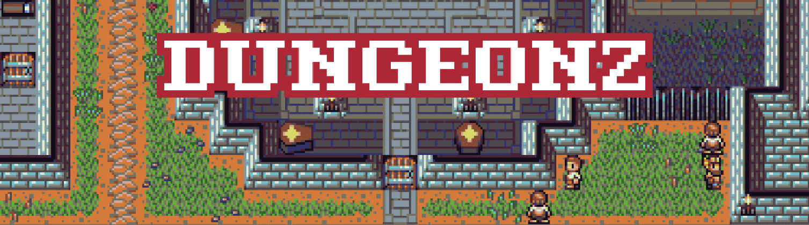
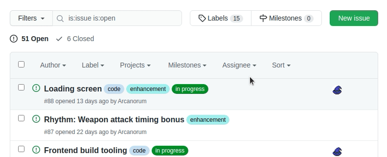

## [https://dungeonz.io/](https://dungeonz.io/)

## Contents
- [Introduction](#introduction)
- [Getting started](#getting-started)
- [Contributing](#contributing)
- [Tooling](#tooling)
- [Attribution](#attribution)
- [Guides](#guides)
- [Links and resources](#links-and-resources)

# Introduction
Greetings! 🧙 You have stumbled upon the work area for Dungeonz, the free, open-source, browser based, massively multiplayer online RPG.

This area is intended for potential contributors who are interested in the project, but don't know where to begin. Any info that someone might want to find about joining and working on the project will probably be here somewhere, and if not, let me know and I'll update this documentation.

Dungeonz is open-source, meaning that anyone is free to see all aspects of how the game works on a technical level, and can also contribute to the project, such as adding new creatures, items, dungeons, balancing, fixing bugs, and whatever else will make the game better.

Here you can find basically everything that goes into the game, what is currently being worked on, and how you can help!

The creation of Dungeonz is a collaborative effort, with content and mechanics able to be added by members of the community.

It is a non-commercial project, so there are no promises of *"rev-share"* or *"backpay when the game makes money"* or whatever. That isn't the goal here.
This project is ideal for beginners, hobbyists, students, portfolio builders, work experience seekers, and of course regular players of the game curious to see how the magic happens.

# Getting started
First, you should have [played the game](https://dungeonz.io/) to get a feel for what it is like, what has been done so far, what looks lacking, and to generally get a good context for what you might want to get started with.

The main contribution areas are code, audio, visual, with other smaller ones like mapping, balance, translations and testing.

You probably came to this project already specialising in one of these. There are [guides](#guides) tailored for contributors that describe the general requirements for each field, that you can jump to if you just want to skip whatever doesn't apply to you.

# Contributing
With so many moving parts to a video game, especially a one like this, it is important to keep the project managed well. I try to run the project like you would find in an actual software company, where each thing being worked on should be detailed, tracked, completed (or cancelled), tested and finally added to the game.

This is done using the main tasks backlog on the GitHub issues page.

### Tasks backlog: https://github.com/Arcanorum/dungeonz/issues

There you can filter by whatever topic interests you using the tag filters.

This is where pretty much everything that is proposed to change about the game should start.

From there, any tasks that are to be grouped together into a larger piece of work, such as a new major feature, will be organised into the project trackers for the major things that are being worked on.

### Project trackers: https://github.com/Arcanorum/dungeonz/projects

***Once you have found something you want to have a go at, you should let me (or other GitHub project admin) know that you want to start something so it can be marked as in progress, so multiple people don't start the same thing.***

# Tooling
### *"What engine is the game made with?"*

This game doesn't use an off the shelf game engine/centralised project manangement GUI, like Unity, Unreal, GameMaker, etc.

As a game that is also a website, it uses many of the tools of the web development trade. The "engine" is a custom setup that brings together various tools that are all free, widely used, and reasonably well documented, that are each specialised for a certain task.

To be able to run and edit the game yourself on your own computer, there is a setup guide that should provide a quick and easy set of instructions to get everything working with minimal messing about and little techincal knowledge. It is basically just installing some other programs that the main game code needs to run, then downloading said code and running it.

The game is written almost entirely in JavaScript, using NodeJS to build the client and run the server. NodeJS is a tool that allows JavaScript to be ran outside of a web browser, and can be loosely thought of as the "engine" that combines the outputs of the other tools to create the game.

**Though, setting up and running the game on your own computer is not necessary for many kinds of contributions.**

A lot of tasks are fairly self contained, mainly creating assets (sprites, sounds), and can just be passed to someone else who does have the rest of the project set up, to integrate into the game on your behalf.

To let people see what the implemented asset is like in game, there is a public test server that is updated with recent work much more often than the live game, and is used for faster turnarounds for testing and feedback, before things go into an update for the live game.

### Public test server: https://test.dungeonz.io/

# Attribution
Proper attribution of all work is expected. This includes original creations submitted by contributors, and anything used from somewhere else (such as opengameart.org or other asset sharing resource).

The credits page for the game lists the currently used assets for the game, and should be updated when new things are used by the project by more authors.

### Credits page: https://dungeonz.io/credits/
A "work" or "works" is a piece of artistic work you have created, such as textures, sprites, sound effects, music, story/lore, etc.

This project uses the [MIT license](https://github.com/Arcanorum/dungeonz/blob/master/LICENSE), and as such can be copied, modified, redistributed, and even used commercially by anyone. Any works you wish to submit will also be included under the project's MIT license.

Under MIT, attribution is not required, but is given anyway as a courtesy.

An attribution may (but doesn't have to) include:
- The specific works you did.
- Your name and/or nickname/alias.
- A link to your website, portfolio, or other profile.

For example:
>Scamp character animation by Arcan (https://github.com/Arcanorum)

You should be asked how you want to be credited when you submit something.

However, if you do not agree to the MIT terms for your submissions, you can submit them using another license that suits your needs, and that one shall take precedence.

For example, if you want to require attribution (credit) for use of your work by anyone else who uses it (such as someone taking the work and using it in another game), you probably want to use one of the CC-BY licenses (https://creativecommons.org/about/cclicenses/). This can be discussed with a project maintainer (i.e. Arcan) as needed.

# Guides
## Project setup
These guides go through setting up the project and getting it running on your computer.

There are 2 sub-guides for setup, depending on what you plan on doing.
- ### [Minimal](guides/minimal_setup/MINIMAL_SETUP.md)
*The fewest requirements for you to be able to get the game running and to be able to make changes, mainly intended for designers.*
- ### [Full](guides/full_setup/FULL_SETUP.md)
*The full developer workflow, mainly intended for programmers.*

# *"I want to add a..."*

Features are divided into two general categories:

## **Mechanics:**

Things like movement, collision, creating entities, AI, new systems, etc. that affects the fundamental flow of the game. Due to how they are often intricately tied to many other things, it is recommended to get some familiarity with the core components of the codebase first and the most common workflows (creating items, creatures and maps), then look for something appropriate in the tasks backlog that has been sufficiently planned out and ready to be worked on.

## **Content:**

Things that implement mechanics to give players stuff to do, such as areas to explore, resources to gather, items to craft, creatures to fight, structures to build, etc.

*Below are guides for each, where you are encouraged to think of something different to add instead of just the examples given and to experiment with each step of the guide, so you aren't just copying the guide without understanding what is happening.*

- ### [Item](guides/items/ITEMS.md)

- ### [Crafting recipe](guides/crafting_recipes/CRAFTING_RECIPES.md)

- ### [Creature](guides/creatures/CREATURES.md)

- ### [Map editor - Walkthrough](guides/map_walkthrough/MAP_EDITOR_WALKTHROUGH.md)

- ### [Map editor - Reference](guides/map_reference/MAP_EDITOR_REFERENCE.md)

- ### [Dungeon](guides/DUNGEONS.md)

- ### Graphic asset guidelines (TODO)

- ### Audio asset guidelines (TODO)

# Links and resources
  - [Live game](https://dungeonz.io/)
  - [Test server](https://test.dungeonz.io/)
  - [Discord server](https://discord.gg/7wjyU7B)
  - [NodeJS](https://nodejs.org/en/) (JavaScript runtime)
  - [MongoDB](https://www.mongodb.com/) (player accounts DBMS)
  - [Phaser](http://phaser.io/) (frontend rendering, input & audio playback framework)
  - [React](https://reactjs.org/) (frontend GUI and build framework)
  - [Free Texture Packer](http://free-tex-packer.com/) (texture packer)
  - [Tiled](https://www.mapeditor.org/) (map editor)
  - [Translations spreadsheet](https://docs.google.com/spreadsheets/u/1/d/1n6jSigPBWrubNQMTz00GsLIh3U8CMtfZH8wMFYmfHaA/edit?pli=1#gid=0)
