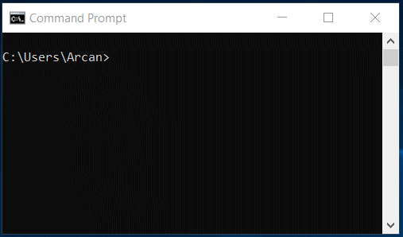
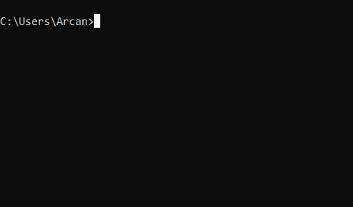
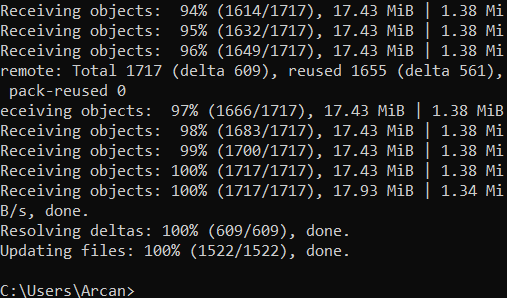
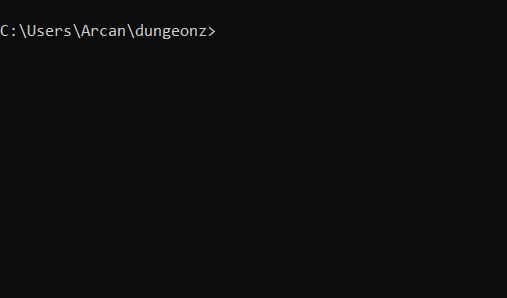
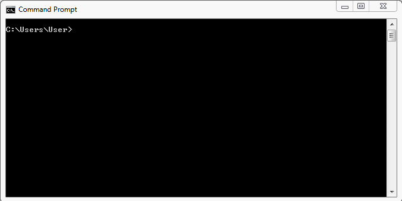
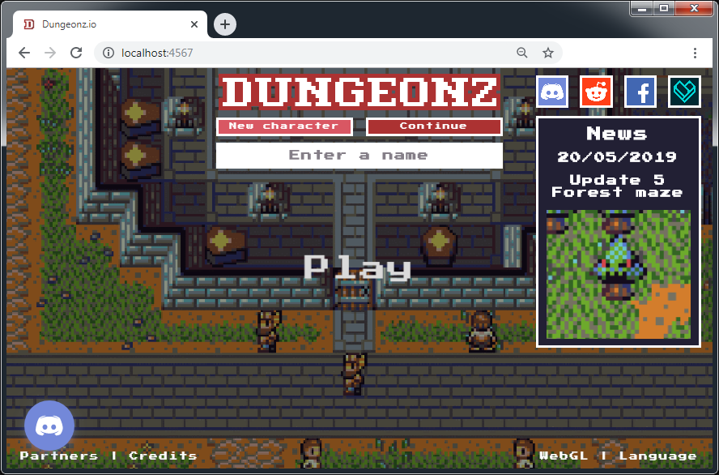

# [Dungeonz](http://142.93.54.176/)

## Everything for the game Dungeonz.

Greetings! You have stumbled upon the work area for Dungeonz, the free, browser based, massively multiplayer online RPG.

## *What is this?*
This is the central code repository for Dungeonz.

Dungeonz is open-source, meaning that anyone is free to see all aspects of how the game works on a technical level, and can also contribute to the project, such as adding new creatures, items, dungeons, balancing, fixing bugs, and whatever else will make the game better.

Here you can find basically everything that goes into the game, what is currently being worked on, and how you can help!

The creation of Dungeonz is a collaborative effort, with content and mechanics able to be added by members of the community.

#### ***This readme is intended for dummies who are interested in the project, but don't know where to begin, so I assume little existing knowledge about many things. If some things don't make sense, then let me know and I wil update this document with clarification.***

## *Ok, cool, where do I start?*

Before you jump into the code and start adding cool new features, there are some things you will need.

**You should understand to an intermediate level:**

- JavaScript (JS)
- Git

**To run the project, you will need:**

- [NodeJS](https://nodejs.org/en/download/) installed (currently using v12.9.1)
- [MongoDB](https://www.mongodb.com/download-center/community) installed (currently using v4.2.0)
- [Git](https://git-scm.com/downloads) installed

**To edit the project, you will also need:**

- An IDE installed (such as VSCode or WebStorm)
- [Tiled](https://www.mapeditor.org/) installed
- A [GitHub](https://github.com/) account
- And probably a Git GUI client (such as GitHub Desktop)

To verify that you have what you need, you can run:
```
node -v
npm -v
mongo --version
git --version
```



***Note for Windows users:*** The MongoDB installer might not add `mongo` to your environment variables, in which case your would get an error such as

`'mongo' is not recognized as an internal or external command, operable program or batch file.`

To fix:
https://stackoverflow.com/questions/42159481/mongodb-node-js-module-mongo-is-not-recognised-as-an-internal-or-external-comm/48840077

## Setup

You will need to download and set up the project to start editing files and hacking away.

Open a command prompt wherever you want the project folder to be, and enter:

`git clone https://github.com/Arcanorum/dungeonz.git`

Which will copy the current version of the project from GitHub to your computer.



Not everything that the project needs to work is included in the repository. For the extra stuff (external dependencies), in the command line in the same directory as the project, run:

`npm i` (Shorthand for `npm install`)

Which will get the rest of the files (as defined in package.json) from NPM and add them to the *node_modules* folders which it should also create in */client* and */server* (this process might take a while).



## Start the server

This should be done *before* building the client, as there are things that the server generates and adds to the client files which the client needs when it is being built.

Open the project root in a command line and run:

 `npm run server`.

If all went well, you should see something like this in the terminal:
```
...
* Board data written to client: dungeon-blood-halls
* Board loaded: dungeon-blood-halls
* Board data written to client: dungeon-shadow-dojo
* Board loaded: dungeon-shadow-dojo
* Board data written to client: dungeon-forest-maze
* Board loaded: dungeon-forest-maze
* Tilesets copied to client assets.
* End of index
```



***Note:*** The MongoDB database must already be running for the game server to start. If it is not running you get an error when you try to start the game server.
```
DB connect error: Error: connect ECONNREFUSED 127.0.0.1:27017
    at TCPConnectWrap.afterConnect [as oncomplete] (net.js:1056:14) {
  name: 'MongoNetworkError',
  errorLabels: [ 'TransientTransactionError' ],
  [Symbol(mongoErrorContextSymbol)]: {}
}
```
To start the database server, open another terminal window and run

`mongod`



You can just minimise this terminal and leave it running while you are doing other stuff with the game server.

To stop the game server, hit `Ctrl + C`, another window should pop up for a second then close itself, then `Ctrl + C` again.

## Build the client

The client (the front end that the user sees) needs to be built before it can be used.
Webpack is used to build the client, which combines everything from the source files into a `dist.js` file which the client can then load and run.

Open the project root in another command line and run

`npm run client`

If all went well, you should see something like this in the terminal:
```
C:\Users\User\dungeonz>npm run client

> dungeonz@0.0.1 client C:\Users\User\dungeonz
> cd client && sass scss/Main.scss:main.css && npm start


> client@1.0.0 start C:\Users\User\dungeonz\client
> webpack --mode development

Hash: 4d985204d46da56bf492
Version: webpack 4.32.2
Time: 2294ms
Built at: 11/02/2019 22:04:51
  Asset      Size  Chunks             Chunk Names
main.js  9.11 MiB    main  [emitted]  main
Entrypoint main = main.js
[./assets/map/dungeon-bandit-hideout.json] 19.5 KiB {main} [built]
[./assets/map/dungeon-blood-halls.json] 25.2 KiB {main} [built]
[./assets/map/dungeon-city-sewers.json] 32.3 KiB {main} [built]
[./assets/map/dungeon-east-pyramid.json] 24.1 KiB {main} [built]
[./assets/map/dungeon-forest-maze.json] 111 KiB {main} [built]
[./assets/map/dungeon-knight-training-arena.json] 26 KiB {main} [built]
[./assets/map/dungeon-shadow-dojo.json] 43.3 KiB {main} [built]
[./assets/map/dungeon-west-pyramid.json] 19.1 KiB {main} [built]
[./assets/map/fight-pit.json] 3.19 KiB {main} [built]
[./assets/map/overworld.json] 7.99 MiB {main} [built]
[./src/Boot.js] 7.47 KiB {main} [built]
[./src/Game.js] 34.5 KiB {main} [built]
[./src/Main.js] 1.02 KiB {main} [built]
[./src/WebSocketEvents.js] 28.1 KiB {main} [built]
[./src/index.js] 83 bytes {main} [built]
    + 185 hidden modules

C:\Users\User\dungeonz>
```


Finally, to open the client and play the game, go to http://localhost/ in a web browser.



## *I want to add a...*

Features are divided into two rough categories:

### **Mechanics:**

Things like movement, collision, creating entities, AI, etc. that affects the fundamental flow of the game. Due to how they are often intricately tied to many other things, these are mostly handled by me, with input from the community.

### **Content:**

Things that implement mechanics to give players stuff to do, such as areas to explore, resources to gather, items to craft, creatures to fight, structures to build, etc.

*Below are guides for each, where you are encouraged to think of something different to add instead of just the examples given and to experiment with each step of the guide, so you aren't just copying the guide without understanding what is happening.*

#### [Map editor - Reference](guides/MAP_EDITOR_REFERENCE.md)

#### [Map editor - Walkthrough](guides/MAP_EDITOR_WALKTHROUGH.md)

#### [Creature](guides/CREATURES.md)

#### [Item](guides/ITEMS.md)

#### [Crafting recipe](guides/CRAFTING_RECIPES.md)

#### [Dungeon](guides/DUNGEONS.md)


For any questions about this project or the game in general, join the Discord server at https://discord.gg/7wjyU7B

### Deployment notes

If deploying to a remote Linux server where you want to run the game server in the background as a service, you might find the provided dungeonz service file useful.

While in the project root directory in a terminal, copy the dungeonz service file to the services directory:

`cp dungeonz.service ../../etc/systemd/system/dungeonz.service`

Give it permissions:

`chmod 644 ../../etc/systemd/system/dungeonz.service`

And use the service with:

`sudo systemctl start dungeonz`

`sudo systemctl status dungeonz`

`sudo systemctl restart dungeonz`

`sudo systemctl stop dungeonz`
