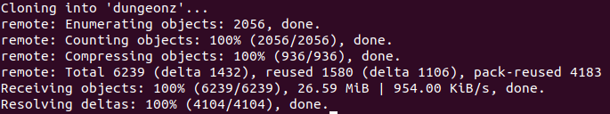
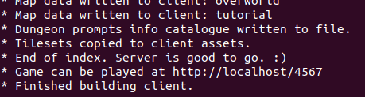
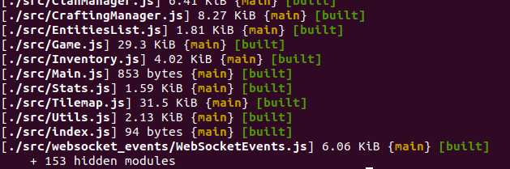
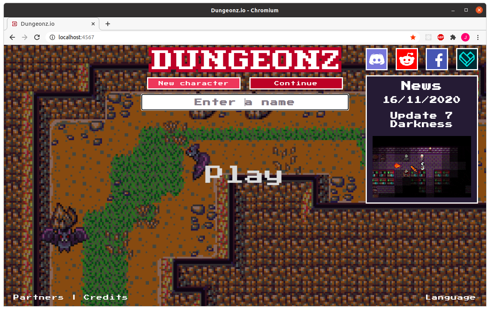

# [Dungeonz](https://dungeonz.io/)

## Everything for the game Dungeonz.

Greetings! You have stumbled upon the work area for Dungeonz, the free, open-source, browser based, massively multiplayer online RPG.

#### ***This readme is intended for dummies who are interested in the project, but don't know where to begin, so I assume little existing knowledge about many things. If some things don't make sense, then let me know and I wil update this document with clarification.***

## *What is this?*
This is the central code repository for Dungeonz.

Dungeonz is open-source, meaning that anyone is free to see all aspects of how the game works on a technical level, and can also contribute to the project, such as adding new creatures, items, dungeons, balancing, fixing bugs, and whatever else will make the game better.

Here you can find basically everything that goes into the game, what is currently being worked on, and how you can help!

The creation of Dungeonz is a collaborative effort, with content and mechanics able to be added by members of the community.

## *Ok, cool, where do I start?*

Before you jump into the code and start adding cool new features, there are some things you will need.

**You should understand to an intermediate level:**

- JavaScript (JS)
- Git

**To run the project, you will need:**

- [NodeJS](https://nodejs.org/en/download/) installed (currently using v12.19.0)
- [MongoDB](https://www.mongodb.com/download-center/community) installed (currently using v4.2.0) (or in a Docker container)
- [Git](https://git-scm.com/downloads) installed

**To edit the project, you will also need:**

- An IDE installed (such as VSCode or WebStorm)
- [Tiled](https://www.mapeditor.org/) installed
- A [GitHub](https://github.com/) account
- And maybe a Git GUI client (such as GitHub Desktop)

***Note for Windows users:*** The MongoDB installer might not add `mongo` to your environment variables, in which case your would get an error such as

> `'mongo' is not recognized as an internal or external command, operable program or batch file.`

To fix:
https://stackoverflow.com/questions/42159481/mongodb-node-js-module-mongo-is-not-recognised-as-an-internal-or-external-comm/48840077

## Setup

You will need to download and set up the project to start editing files and hacking away.

Open a command prompt wherever you want the project folder to be, and enter:

`git clone https://github.com/Arcanorum/dungeonz.git`

Which will copy the current version of the project from GitHub to your computer.



Not everything that the project needs to work is included in the repository. For the extra stuff (external dependencies), in a terminal in the same directory as the project, run:

`npm install`

Which will get the rest of the files (as defined in package.json) from NPM (this process might take a while) and add them to the *node_modules* folders which it should also create in *dungeonz*, *dungeonz/client* and *dungeonz/server*.

## Start the server

Open the project root in a terminal and run:

 `npm run server`.

If all went well, you should see something like this in the terminal:



***Note:*** The MongoDB database must already be running for the game server to start. If it is not running you get an error when you try to start the game server.
```
DB connect error: Error: connect ECONNREFUSED 127.0.0.1:27017
    at TCPConnectWrap.afterConnect [as oncomplete] (net.js:1056:14) {
  name: 'MongoNetworkError',
  errorLabels: [ 'TransientTransactionError' ],
  [Symbol(mongoErrorContextSymbol)]: {}
}
```
To start the database server, open another terminal window and run

`mongod`

You can just minimise this terminal and leave it running while you are doing other stuff with the game server, or run it as a service in the background if you know how.

To stop the game server, hit `Ctrl + C`, another window should pop up for a second then close itself, then `Ctrl + C` again.

It would be annoying to have to keep manually stopping and restarting the server during development every time you make a change, so a script is included that starts a file watcher that will automatically restart the server when a change is saved to a file in /server.

In the project root, run

`npm run server:dev`

## Build the client

The client (the front end that the user sees) needs to be built before it can be used.
Webpack is used to build the client, which combines everything from the source files into a `dist.js` file which the client can then load and run.

Open the project root in another terminal and run

`npm run client`

If all went well, you should see something like this in the terminal:



***Note:*** The server itself also builds the client in the same way every time it starts, as there are some resources that the server generates when it starts that the client also needs to work correctly, so when the server is finished, it does a client build to save you from manually having to also rebuild the client each time the server starts/restarts.

When making changes to just client files, the client must be rebuilt each time for the changes to take effect.

It would also be annoying to have to keep manually rebuilding the client each time during development every time you make a change, so a script is included that starts a file watcher that will automatically rebuild the client when a change is saved to a file in /client.

Open the project root in another terminal and run

`npm run client:dev`

Finally, to open the client and play the game, go to http://localhost:4567 in a web browser.



# *I want to add a...*

Features are divided into two general categories:

## **Mechanics:**

Things like movement, collision, creating entities, AI, etc. that affects the fundamental flow of the game. Due to how they are often intricately tied to many other things, these are mostly handled by me (Arcan), with input from the community.

## **Content:**

Things that implement mechanics to give players stuff to do, such as areas to explore, resources to gather, items to craft, creatures to fight, structures to build, etc.

*Below are guides for each, where you are encouraged to think of something different to add instead of just the examples given and to experiment with each step of the guide, so you aren't just copying the guide without understanding what is happening.*

### [Map editor - Walkthrough](guides/MAP_EDITOR_WALKTHROUGH.md)

### [Map editor - Reference](guides/MAP_EDITOR_REFERENCE.md)

### [Creature](guides/CREATURES.md)

### [Item](guides/ITEMS.md)

### [Crafting recipe](guides/CRAFTING_RECIPES.md)

### [Dungeon](guides/DUNGEONS.md)

### [Translation](https://docs.google.com/spreadsheets/u/1/d/1n6jSigPBWrubNQMTz00GsLIh3U8CMtfZH8wMFYmfHaA/edit?pli=1#gid=0)

## **Links**

### See the latest changes before they go live on the public test server at https://test.dungeonz.io/

### For any questions about this project or the game in general, join the Discord server at https://discord.gg/7wjyU7B
