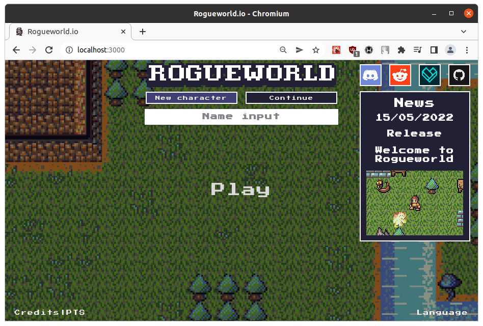

# Quickstart

Install packages.
```
npm i
```
Start the main game service in dev mode.
```
npm run dev -w services/game
```
Start the client in dev mode.
```
npm run dev -w clients/game
```
Go to localhost:3000 in your browser.



# Tech stack
## You should understand to an intermediate level
- TypeScript/JavaScript/[NodeJS]((https://nodejs.org/en/download/) )
- [Git](https://git-scm.com/downloads)

## Would also be useful to know, depending on what you are doing
- [Phaser](https://phaser.io/) (rendering, input, audio playback)
- [React (NextJS)](https://reactjs.org/) (GUI)
- [MongoDB]((https://www.mongodb.com/download-center/community)) (storage of player accounts and game world state)

## To run the project, you will need:
- NodeJS installed (currently only v16.13.0 is officially supported, though other versions may work.
- MongoDB installed (or in a Docker container).
- Git installed.
- An IDE.
- A [GitHub](https://github.com/) account.
- Maybe a Git GUI client (such as GitHub Desktop).

# Repository overview

This repository is organised as a monorepo, using NPM workspaces to manage dependencies across the different sub-projects.

Note the presence and structure of the `services` and `clients` directories.

There are commonalities and assumptions that are made about what each sub-project is using in it's tech stack, so this isn't a *true* monorepo in the strictest definition of the term (where every sub-project is self-contained), but instead the goal is to make development easier to get started with by standardising the tech stack across the project somewhat for the sake of simplicity and stability, while still offering enough separation of concerns as to how the various parts of the codebase relate to each other, and defining a suitable structure to easily expand into as the needs of the game grow.

# Services
A "service" is typically a backend server that can be connected to by a client or another service, that handles a particular area of functionality.

See the description in each `package.json` file in each service project for a brief overview of that service.

Each service has some kind of connection endpoint waiting for requests, such as a REST API, websocket server, or both, or some flavour of each (i.e. Apollo (GraphQL), Socket.io, etc.).

Spreading out the work to be done across several services has the following benefits:
- Greater separation of concerns and less tight coupling within the code.
- Helps mitigate the impact of outages, such as the process crashing, as only that one area of functionality will be affected. For example, if the map service dies for whatever reason, only the in-game map panel would stop working, but the rest of the game can keep running.
- Allows easier horizontal scaling, without having to also scale other areas of functionality that don't need any extra capacity. Some functionality has a high performance cost, or may experience spikes in demand (or deliberate abuse), so to avoid those from having a negative impact on unrelated areas, it is better to isolate these potentially expensive or high demand operations to their own service, so more instances of it can be created to increase capacity.

# Clients
A "client" is any frontend application. The main one is the main game client that users use to play the game.

Clients connect to services to request any other data that they need or any state they want to change, such as moving their character.

## Next.js and shared local modules
To get this monorepo setup working with the shared local modules in the `shared` directory, each client project uses NextJS, which can transpile those modules thanks to the [`next-transpile-modules`](https://github.com/martpie/next-transpile-modules) package. Transpiled modules can be changed by editing the `transpileModules` option in `clients/[app name]/next.config.js`.

This is the first solution that I found would work nicely with this kind of monorepo structure (after trying *many* other setups with endless issues). Apart from that, NextJS isn't used for anything in particular.

# Configuration
I'm a big advocate of abstracting any regularly changed values within the codebase out into options that can be set in a config file. This removes the need to keep editing code files, and allows non-programmers to experiment with changing things without needing to expose them to the complexities of whatever is using that value.

All of these kinds of configuration files can be found in the `shared/config` module.

The main one that you will want to concern yourself with at first is `Settings.default.yaml`, which contains options for the top level project config, and various aspects of core gameplay.

As you might have worked out by the "default" in the file name, this file shouldn't be modified just for experimenting during development, as the values in it are usually considered the "official" or "prod" settings used by the live game, so only change it if it is necessary for a task. If you are working on a new feature that you think should be configured here, then add a new setting for it.

To change the values during development/testing, create a file in the same directory called `Settings.yaml` (this file will not be tracked in git, so you can do whatever you want with it).

This file can contain any of the same values found in `Settings.default.yaml`, but will override them.

For example, you could configure it like

```yaml
# Move faster
PLAYER_MOVE_RATE: 100
# Higher HP
PLAYER_MAX_HITPOINTS: 10000
# Disable food drain
PLAYER_FOOD_DRAIN_RATE: 0
```

and these settings will take priority over the same settings in `Settings.default.yaml`.

# Troubleshooting

## Client or service not automatically restarting/rebuilding after saving changes

This can happen for several reasons. Most common of which is running out of available watchers on your OS by having multiple processes running in development mode at once, such as the game service, game client, and others.

Each development process uses a large amount of watchers to track the files and trigger a rebuild/restart when they are saved, so increasing the max amount of these watchers may fix this. Adding more watchers does consume a very small amount of memory, but it isn't noticable unless you go crazy with it.

`echo fs.inotify.max_user_watches=524288`

https://stackoverflow.com/questions/26708205/webpack-watch-isnt-compiling-changed-files
