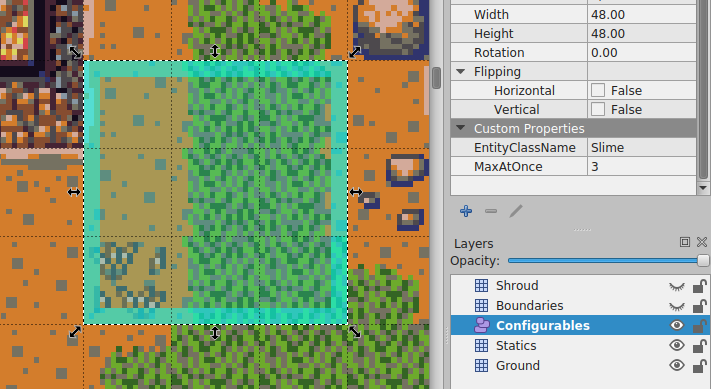

# Getting started: Creatures

This guide will go through adding a new monster entity to the game, *Slime*, and a boss variant, a *Giant Slime*.

To add a creature to the game:
- Create a server entity file (for logic)
- Create a client sprite file (for display)
- - Create sprite assets (for appearance)

# Creating a mob
## Create a server file

Most entities in the game have their own JS file that contains its specific functionality.

Any custom logic for a particular entity belongs in this file.

Create a new JS file for the creature you want to add to *server/src/entities/destroyables/movables/characters/mobs*

Every mob should have at least the following code for it to be valid.

### Slime.js
```js
const Mob = require("./Mob");

class Slime extends Mob {}
module.exports = Slime;
```

## Add it to the mob stat values definitions list

Mobs have their configuration defined in *server/src/entities/destroyables/movables/characters/mobs/MobValues.yml*

This is where you define most of the generic configuration of the creature (hitpoints, move rate, what weapon it uses, etc.).

### MobValues.yml
```yml
...

- name: Slime
  gloryValue: 60
  defence: 10
  viewRange: 5
  moveRate: 1200
  attackRate: 1500
  meleeDamageAmount: 15
  faction: HostileAnimals
  dropList:
    - itemName: GreenCap
      dropRate: 30

...
```

You can look through the other mob configurations in this file, or see the prototype properties defined on the `Mob` class to see available properties that can be set here.

## Create a client file

A logical entity now exists for the slime on the server, but it needs a graphical representation on the client, a sprite.

Just like on the server, every mob needs its own JS file on the client.

Create a JS file with the same name as the server JS file, in *client/src/entitites/characters*.

### Slime.js
```js
import Character from "./Character";

class Entity extends Character {
    constructor(x, y, config){
        super(x, y, config);

        this.displayName.setText(dungeonz.getTextDef("Mob name: Slime"));
    }
}

Entity.prototype.animationSetName = "slime";

export default Entity;
```

This creates and configures a sprite for the mob, and it expects a set of frames called `slime` to use for the animations to play when the mob moves.

When the client is built during `npm run client` or at the end of `npm run server`, all of these files will be scanned through and combined into a texture atlas, which is what the client class file uses to set up the animations.

These frames must be defined as *client/assets/img/entities/characters/**[mob name]**/**[mob name]**-**[direction]**-**[frame number]**.png*

So for our slime example, the following files are expected to exist:

- *client/assets/img/entities/characters/slime/slime-up-1.png*
- *client/assets/img/entities/characters/slime/slime-up-2.png*
- *client/assets/img/entities/characters/slime/slime-up-3.png*
- *client/assets/img/entities/characters/slime/slime-down-1.png*
- *client/assets/img/entities/characters/slime/slime-down-2.png*
- *client/assets/img/entities/characters/slime/slime-down-3.png*
- *client/assets/img/entities/characters/slime/slime-left-1.png*
- *client/assets/img/entities/characters/slime/slime-left-2.png*
- *client/assets/img/entities/characters/slime/slime-left-3.png*
- *client/assets/img/entities/characters/slime/slime-right-1.png*
- *client/assets/img/entities/characters/slime/slime-right-2.png*
- *client/assets/img/entities/characters/slime/slime-right-3.png*

## Add it to the game world

To make this entity appear on a map use its class name in a spawner area object.



# Creating a boss

The process for creating a boss entity is almost exactly the same, but the classes to extend from are different.

To create a boss variant of the slime mob just created:

## Server file
### GiantSlime.js
```js
const Mob = require("./Boss");

class GiantSlime extends Boss {}
module.exports = GiantSlime;
```

## Config
### MobValues.yml
```yml
...

- name: GiantSlime
  gloryValue: 200
  defence: 20
  viewRange: 7
  moveRate: 1500
  attackRate: 1500
  meleeDamageAmount: 35
  faction: HostileAnimals
  dropList:
    - itemName: ExpOrbMelee
      dropRate: 30
    - itemName: ExpOrbPotionry
      dropRate: 30
    - itemName: GreenCap
      dropRate: 30
      rolls: 2

...
```

## Client file
### GiantSlime.js
```js
import Boss from "./Boss";

class Entity extends Boss {
    constructor(x, y, config) {
        super(x, y, config);

        this.displayName.setText(dungeonz.getTextDef("Mob name: Giant slime"));
    }
}

// A lot of bosses are just bigger versions of another mob, so you can use the same set of animations for both if you want, and not have to create another set of animations.
Entity.prototype.animationSetName = "slime";

// Or if you want it to look different, you can create another set of animations just for this boss mob, and add the frame images for it described below.
Entity.prototype.animationSetName = "giant-slime";

export default Entity;
```

### Animation set

- *client/assets/img/entities/characters/giant-slime/giant-slime-up-1.png*
- *client/assets/img/entities/characters/giant-slime/giant-slime-up-2.png*
- *client/assets/img/entities/characters/giant-slime/giant-slime-up-3.png*
- *client/assets/img/entities/characters/giant-slime/giant-slime-down-1.png*
- *client/assets/img/entities/characters/giant-slime/giant-slime-down-2.png*
- *client/assets/img/entities/characters/giant-slime/giant-slime-down-3.png*
- *client/assets/img/entities/characters/giant-slime/giant-slime-left-1.png*
- *client/assets/img/entities/characters/giant-slime/giant-slime-left-2.png*
- *client/assets/img/entities/characters/giant-slime/giant-slime-left-3.png*
- *client/assets/img/entities/characters/giant-slime/giant-slime-right-1.png*
- *client/assets/img/entities/characters/giant-slime/giant-slime-right-2.png*
- *client/assets/img/entities/characters/giant-slime/giant-slime-right-3.png*
