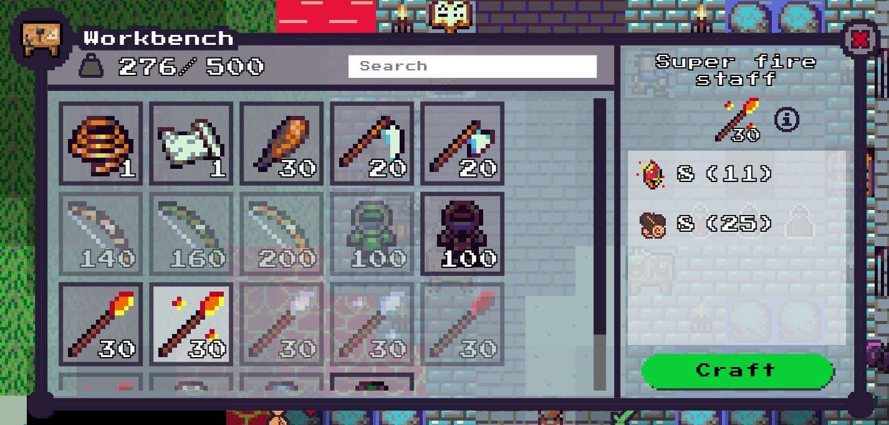

# Getting started: Crafting recipes
A crafting recipe is a set of items that can be combined at a crafting station to create another item.



Adding a new crafting recipe is as easy as adding a new config for it to the `CraftingRecipes.yml` config file.

Documentation for how to configure each recipe can be found at the top of that file.

To add a recipe for a recently added item (for example the "Wooden sword" item created in the [*Getting started: Items*](../items/ITEMS.md) guide), simply add the following:

```yml
- stationTypes:
    - Workbench
  stats:
    - Weaponry
    - Melee
  ingredients:
    - itemName: PineLogs
      quantity: 4
  result:
    itemName: WoodenSword
```
