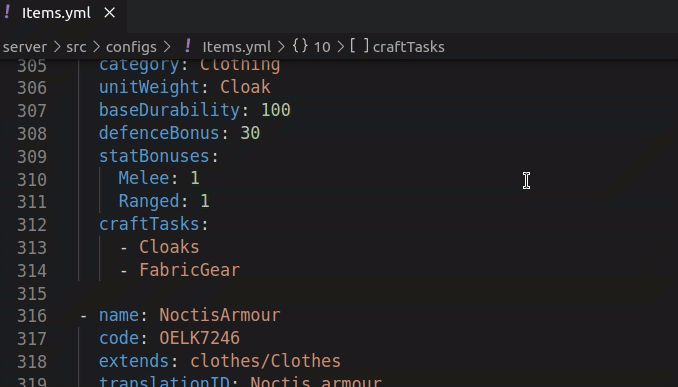
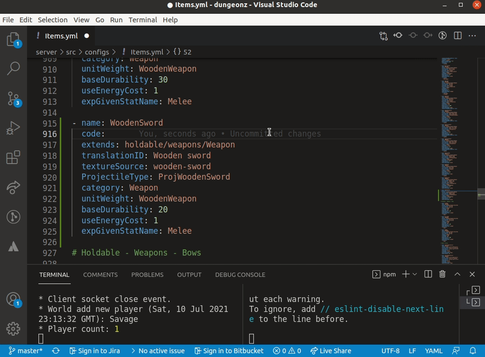
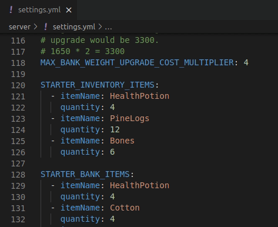
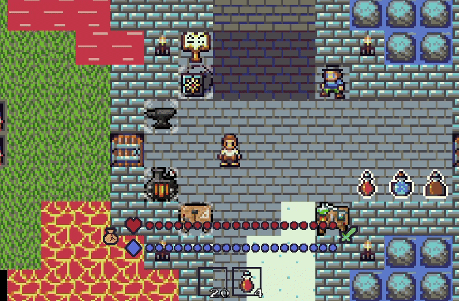
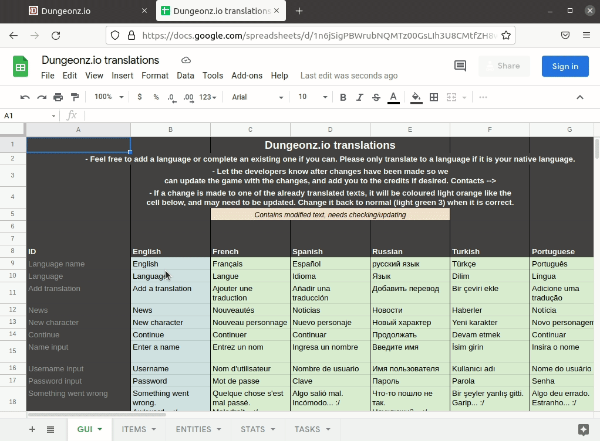
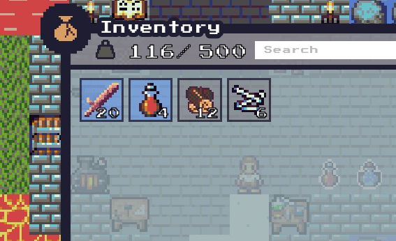

# Getting started: Items
An item is an object that a player can obtain and can be used for many game functions, such as combat, resource gathering, crafting and interacting with other objects.

An item can exist in one of two states:
- As a logical [`Item`](../../server/src/items/classes/Item.js) instance in an inventory or bank slot.
- As a concrete [`Pickup`](../../server/src/entities/classes/destroyables/pickups/Pickup.js) entity instance on a board tile.

Each item type has an associated pickup type, which is an entity that allows the item to be dropped and added to the board (Item to Pickup) or picked up by a player and removed from the board (Pickup to Item).

This guide details the creation of two kinds of items, a simple item that only needs to be defined as a config object, and a more complex item that has unique functionality and will require it's own logic file.

# Creating a simple item
This guide will go through adding a new weapon to the game, *Wooden sword*.

## Add an item config
Every item in the game has an associated configuration object, which details the stats and meta info about that item.

These item configs are defined in the [`Items.yml`](../../server/src/configs/Items.yml) config file.



Here, a new entry can be added for the wooden sword item we want to create.

A lot of the time you can get away with just copying the config for an existing item that is similar and adjusting it as needed.

In the [`Items.yml`](../../server/src/configs/Items.yml) file add the following:

```yml
- name: WoodenSword
  code: 
  extends: holdable/weapons/Weapon
  translationID: Wooden sword
  textureSource: wooden-sword
  ProjectileType: ProjWoodenSword
  category: Weapon
  unitWeight: WoodenWeapon
  baseDurability: 20
  useEnergyCost: 1
  expGivenStatName: Melee
```

Which is enough to get a basic new item working.

Notice the `code` property has no value.
This is because this property must be unique across all items, and so cannot be simply copied and pasted like other values.

To generate a new unique code to use for this item, there is a script that can be run in a terminal in the project root directory.

Open a new terminal and enter the following command:

`npm run itemcode`

Which will give a 8 character code that can be used for the `code` property above.

```yml
- name: WoodenSword
  code: PRUB5021
  ...
```



Now when you save the file and the server restarts, it should stop with an error about invalid projectile type.

>ERROR: Loading weapon config. Invalid projectile type name "ProjWoodenSword" for configured item "WoodenSword". Type to use must be in the entities list.

This is because the projectile to use for this new item doesn't exist yet, so must be created.

## Add a projectile config
Now a wooden sword projectile entity type must be created to use as the thing that this item will emit as it's attack.

All projectiles are defined in the [`Projectiles.yml`](../../server/src/configs/Projectiles.yml) config file.

Creating a new basic projectile type is as simple as adding a new config there.

A new entity class will be automatically generated for each of these configs, and they will be added to the central entities list to be used elsewhere, such as for the projectile type for an item or mob.

In the [`Projectiles.yml`](../../server/src/configs/Projectiles.yml) file add the following:

```yml
- name: WoodenSword
  moveRate: 200
  range: 3
  collisionType: Melee
  damageAmount: 8
  damageTypes:
    - Physical
  textureFrames: wooden-sword
```

Which when saved and the server restarts should solve the error.

## Test the item
Now we have set up the logical components of an item, and it's projectile. To check that the item so far is actually working, let's see how it looks in game.

To make testing easier, we can add this new item to the default inventory of new players.

This can be done in the `settings.yml` config file in */server.*

>If you do not yet have a `settings.yml` file, you can make a copy of the `settings.example.yml` file in the same directory.

In `settings.yml`, find the `STARTER_INVENTORY_ITEMS` config and add the following:

```yml
STARTER_INVENTORY_ITEMS:
  - itemName: WoodenSword
```



Now when you enter the game as a new character (not logged in), you should see the item in your inventory.



With this we can see that the item works, but there are some problems with how it looks; It is missing the correct graphic assets to use.

## Add sprites
There are 2/3 kinds of sprite that an item expects, as defined in the configs.

- A GUI icon. This is what appears in the hotbar and any item related panels.
- A pickup sprite. When an item is dropped a pickup entity is created for it on the floor, which needs it's own sprite (that looks like the GUI icon but with a border). Fortunately this is generated automatically using the matching GUI icon when the client is started, so we don't have to worry about creating this one.
- A projectile sprite. For weapons that shoot something, the projectile that was created should have it's own sprite.

>The following item asset files must be in .PNG format.

### Add a GUI icon
Draw an image for the item, and add it to the */client/src/assets/images/gui/items* directory.

The file name of this asset is used to identify it in the item config you added to [`Items.yml`](../../server/src/configs/Items.yml), under the `textureSource` config.

It will expect a file in the following format `icon-[ITEM NAME].png`

For exmaple, for this wooden sword the config is:

`textureSource: wooden-sword`

So the file it will look for would be:

`icon-wooden-sword.png`


### Add a projectile sprite
Draw an image for the projectile, and add it to the */client/src/assets/images/entities/projectiles* directory.

The file name of this asset is used to identify it in the projectile config you added to [`Projectiles.yml`](../../server/src/configs/Projectiles.yml), under the `textureFrames` config.

It will expect a file in the following format `proj-[ITEM NAME].png`

For exmaple, for this wooden sword the config is:

`textureFrames: wooden-sword`

So the file it will look for would be:

`proj-wooden-sword.png`

Once these files are in place, **you must restart the client process** for the newly added assets to be repackaged into the game client files correctly.

In the terminal where you ran `npm run client:dev`, stop the process (usually `Ctrl + C`) and run `npm run client:dev` again to start the client again.

## Test the item again
If everything went ok, you should now see the item is using the correct assets.


## Add a translation
You may have noticed that the item name and description are incorrect when hovered over.

Every item should have an entry in the translations spreadsheet, which defines what text to use for each item in each language the game supports.

A definition needs to be added for this new item.

**Translations spreadsheet:**
https://docs.google.com/spreadsheets/d/1n6jSigPBWrubNQMTz00GsLIh3U8CMtfZH8wMFYmfHaA/edit#gid=0

1. Open the spreadsheet.
2. Go to the *ITEMS* sheet/tab.
3. Find somewhere appropriate to add a new definition.
4. Add a new row.
5. In the first column (**A**) of this row, add a text value in the format `Item name: [translationID]`, where `[translationID]` is the value of the `translationID` property of the config for the item you added in [`Items.yml`](../../server/src/configs/Items.yml). In this case, `Item name: Wooden sword`
6. Add a value for the name of the item in the second column (**B**). This is what will appear for the item name in game and can be anything, but is usually the same as the `translationID` value.
7. Add a new row.
8. In the first column (**A**) of this row, add a text value in the format `Item description: [translationID]`.i.e. `Item description: Wooden sword`
9. Like for the item name, this description can be what ever you want. Describe the functionality of an item, or just some flavour text, but avoid including specific stats here as they may change.
10. Download the updated spreadsheet. Top menu -> File -> Download -> Microsoft Excel (.xlsx)
11. Replace the current `Dungeonz.io translations.xlsx` file in */server* with the downloaded version.



After the server restarts, the text for the item in game should be updated.



## Done!
That is the basic process for adding most items in the game. Try changing the values in the config files to experiment with the item.

Consider adding another item of a different kind for practice, adding a crafting recipe for this new item (see the [*Getting started: Crafting recipes*](../crafting_recipes/CRAFTING_RECIPES.md) guide), or move on to the more advanced guide for more complex items.

>Keep in mind the [item design philosophy](https://github.com/Arcanorum/dungeonz/wiki/Item-design-philosophy) when coming up with new item ideas.


# Creating a complex item

>This guide builds upon the process from creating a simple item. Make sure you understand how that works first.

// TODO

<!-- ## Create a server file

Every item in the game has its own JS file that contains its functionality and any configuration that is specific to that item.

>This guide will require some basic JavaScript knowledge, but should still be fairly easy to follow along.

Any custom logic for a particular item belongs in this file.

In `server/src/items/` there are several sub-directories for more specific item types, which should be where you organise items by category based on their function.

In this case, an wooden sword will be a weapon, and a weapon is holdable, so create a new JS file for the item to add to `server/src/items/holdable/weapons`.

Every weapon should have at least the following code for it to be valid.

### ItemIronSpear.js
```js
const Item = require("./Item");

class IronSpear extends Item {}

IronSpear.translationID = "wooden sword";
IronSpear.iconSource = "icon-iron-spear";

module.exports = IronSpear;
``` -->
