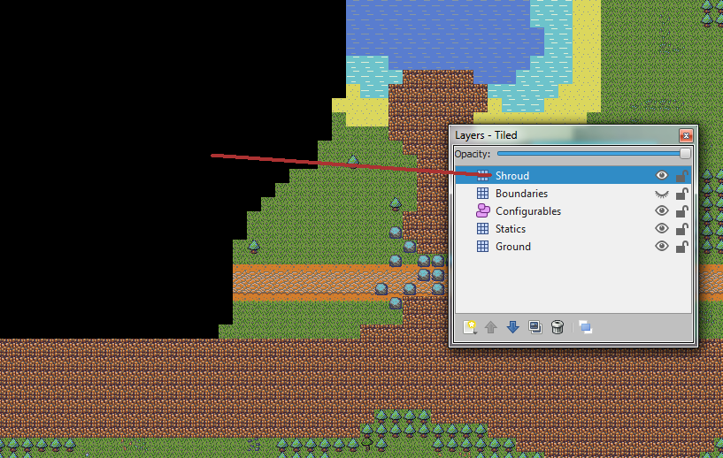
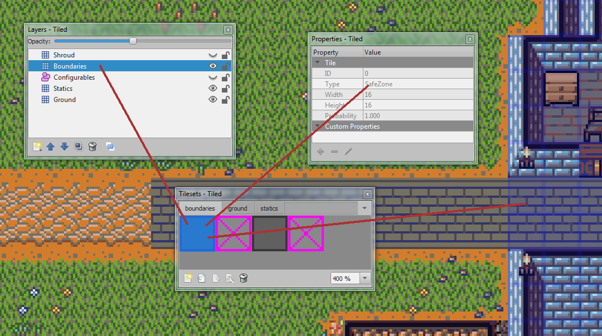
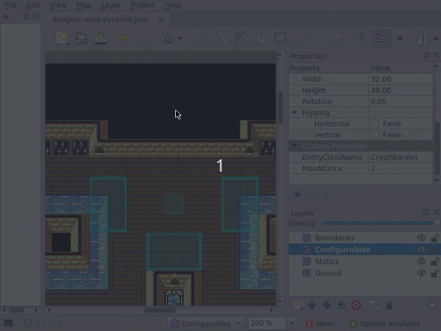

# Getting started: Map editor - Reference

# Layers

Each map file has a set of layers in it. A layer is basically a surface to add game world features to, which logically groups those features together.

Each layer handles a particular aspect of the map, and each one is used in a different way by the server code when the world is created.

There are 2 kinds of layer available:

### **Tile layers:**
Used to add things to the map in a visual way using tiles from the corresponding tilesets. Select one of the tiles on a tileset to see the properties of that tile. With it selected, you can draw on the matching layer to add that tile to the world.

***Note:*** Make sure you have the right tileset selected when adding to a tile layer!
Tiles from a tileset must be added to the matching layer or they won't work.
Boundaries tileset -> Boundaries layer, etc.

### **Object layers:**
Used for adding more complex features to the map.
There is only one object layer, *"Configurables"*, which as the name suggests, is for anything that needs to be configured in some way, such as entity spawners, entrances & exits, dungeon portals, etc.

***Note:*** Be careful when placing objects that you don't accidentally stack them completely on top of each other, as they can be hard to notice when stacked!

## - **Shroud layer**

A special layer used to cover areas of the map for when generating the world map image, so unfinished and secret areas can be hidden. Currently only used on the Overworld map.

***Note:*** This layer is **not** rendered in game. It is only used for when looking at the world map.

## - **Boundaries layer**

A boundary is a way of marking an area of the map to behave in a specific way.

Currently the only meaningful boundary that can be applied is the *SafeZone* tile, which defines what tiles will disable PvP, so players cannot damage each other. Covers the main city area and banks.

***Note:*** PvP is disabled inside dungeon instances already, so you don't need to cover dungeon maps in this tile to disable PvP inside them.

The *Darkness* tile will possibly be used in the future for marking areas as being dark, even during the day, such as in caves or buildings.

## - **Ground layer**

The floor of the game. Basic ground tiles, some of which have certain properties or cause certain effects.

See *src/board/GroundTypes.js* for the configuration of the available ground types.

## - **Statics layer**

Statics are permanent features of the game world. They cannot be moved or removed, like a wall, statue or boulder.

Some static types can still be interacted with and have their state changed, i.e. a door is always there but can open/close, or a tree can be chopped down/regrow.

Also used for non-physical and non-interactive things like decorations, i.e. flowers, pebbles, slime, etc.

## - **Configurables layer**

Where most of the magic happens. Tiled has an Object entity that can be added to maps, that has a position, size, and can have properties added to it. This makes it suitable for defining almost anything we would want to pass into the server during initialisation, such as where to place an entity spawner, how big it should be, and what kind/how many of a certain kind of entity to spawn onto the board.

These objects are also considered as statics in the same way as for the statics layer, in that they cannot be moved or removed, but they can be used to cause dynamic changes to the game world, i.e. a spawner is a configurable kind of static and will always be on the board in the background, but it has the effect of adding other entities to the board (such as creatures and pickups) which themselves are dynamic (can be moved/removed).

There are some templates for commonly used object configurations, called `Object Types` in Tiled, that are linked to the appropriate tiles on the statics tileset. Simply selecting a configurable tile from the statics tileset and clicking on the map with the **Insert Tile** tool selected will add a blank object of that type with the necessary custom properties to configure, and a matching graphic.

# Entrances & exits

Many entrances can go to the same exit, and many exits can go to the same entrance.

Each exit can only have one entrance that it leads to.

# Map properties

| Property name | Type | Default | Description |
|---------------|:----:|:-------:|-------------|
| AlwaysNight | bool | false | Whether this map should always be night/dark and ignore changes in the time of day outside. Useful for maps that are underground or indoors and should always have the darkness effect active.
| IsDungeon | bool | false | Whether this map is for a dungeon. Dungeon maps are not added to the world on server startup. They are only created on demand when a party starts a dungeon instance from a dungeon manager.

If **IsDungeon** is set to `true`, then you should also add the following map properties to configure the dungeon.

| Property name | Type | Default | Description |
|---------------|:----:|:-------:|-------------|
| NameDefinitionID | string | Unnamed | The ID of the field in the text definitions spreadsheet, where the name of this dungeon can be found. Add your desired name for this dungeon to the spreadsheet and reference it here.
| Difficulty | string | Beginner | How difficult this dungeon is, relative to most other dungeons. Determines the glory cost to enter the dungeon. **Valid values:** Beginner, Advanced, Expert, Master.
| MaxPlayers | int | 6 | Limit of how many players can be in the party that enters this dungeon.
| TimeLimitMinutes | int | 20 | The time limit of this dungeon in minutes, after which all players are evicted.
| EvictionMapName | string | overworld | The name of the map that this dungeon should evict any players inside it to when the allowed time is up. This must match the name of the target map by it's file name, i.e. to make this dungeon evict players to another map called `pit-of-doom.json`, then set this to `pit-of-doom`.
| EvictionEntranceName | string | city-spawn | The name of the entrance on the eviction board (as defined in **EvictionMapName**) to place the players within when they are evicted from this dungeon.

# Object types and their properties

## - **SpawnerArea**
Defines an area into which entities will spawn.
Each spawner keeps a list of all of the entities that have been spawned from it, and replaces them when they are destroyed (creature dies, item pickup gets picked up or disappears, projectile hits something, etc.)

| Property name | Type | Default | Description |
|---------------|:----:|:-------:|-------------|
EntityClassName | string | (varies) | The name of the entity type to spawn. Must be a subclass of `Destroyable` (anything under *server/src/entities/destroyables/*). For mobs this is defined as the `name` property for each entry in *.../mobs/MobValues.yml*, i.e. "DwarfWarrior". For item pickups this is defined as "Pickup" followed by the `name` property of an entry in *.../items/ItemValues.yml*, i.e. "PickupDungiumHammer". For everything else use the entity name as it looks in it's file name, i.e. "ProjWind". Case sensitive.
MaxAtOnce | int | 0 | How many entities can exist in the world at once that were created from this spawner. When one dies, another is spawned in after the spawn rate delay.
SpawnRate | int | (varies) | How long to wait in milliseconds before this spawner will create another entity after an existing entity created by this spawner is destroyed. The default can vary by entity type. Most entities have a default of 60 seconds. Pickups have a default of 20 seconds. Check the matching type file for `spawnRate`. ***Note:*** This property has no effect in dungeon maps (map property **IsDungeon** is true), as all spawners activate immediately and then never again, as entites do not respawn in dungeon instances.
RedKeys | int | | Dungeon maps only. Any mobs created by this spawner will give this many red keys to the party when each spawned mob dies.
GreenKeys | int | | Dungeon maps only. Any mobs created by this spawner will give this many green keys to the party when each spawned mob dies.
BlueKeys | int | | Dungeon maps only. Any mobs created by this spawner will give this many blue keys to the party when each spawned mob dies.
YellowKeys | int | | Dungeon maps only. Any mobs created by this spawner will give this many yellow keys to the party when each spawned mob dies.
BrownKeys | int | | Dungeon maps only. Any mobs created by this spawner will give this many brown keys to the party when each spawned mob dies.

## - **Entrance**
An area that can be used to define where to move an entity to.
Usually paired with an exit, where the entrance is where a player will end up if they move into the exit tile.

| Property name | Type | Description |
|---------------|:----:|-------------|
| EntranceName | string | | Used to identify this entrance. Must be unique on the board the entrance is on. Another entrance with the same name can exist on a different board.

## - **Exit**
Removes a player from one board and adds them to another, positioning them somewhere within an entrance on the board they are moved to.

| Property name | Type | Description |
|---------------|:----:|-------------|
| TargetBoard | string | The name of the board to move the player to, as it looks in the file name of the map file, i.e. to link to the map `pit-of-doom.json`, then set this to `pit-of-doom`.
| TargetEntranceName | string | The name of the entrance on the target board to move the player to. The **EntranceName** property of the target Entrance object.

## - **DungeonPortal**
Allows access to a dungeon map.
Functions similar to an exit in that it will move a player to a specified Entrance inside of a dungeon, but has criteria that must be met by the player that interacts with it, such as them having the glory entry cost. The target entrance that it looks for on the target map must have a **EntranceName** property of `dungeon-start`.
| Property name | Type | Description |
|---------------|:----:|-------------|
| DungeonName | string | Since dungeon maps are created on demand when a party wants to play a dungeon, this property is simply the name of the dungeon to use within the dungeon managers list, which itself is based on the file names of the dungeon maps, i.e. for a dungeon map with file name `dungeon-castle-doom.json`, then set this to `castle-doom`.

## - **OverworldPortal**
Functions similar to an exit, in that it will move a player to a specified Entrance on the overworld map, but also adds a graphic for it to the client map data, as a regular Exit is just an invisible bounds that exists on the server.
| Property name | Type | Description |
|---------------|:----:|-------------|
| TargetBoard | string | The name of the board to move the player to, as it looks in the file name of the map file, i.e. to link to the map `pit-of-doom.json`, then set this to `pit-of-doom`.
| TargetEntranceName | string | The name of the entrance on the target board to move the player to. The **EntranceName** property of the target Entrance object.