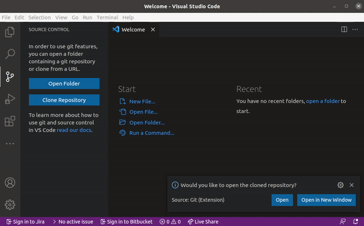
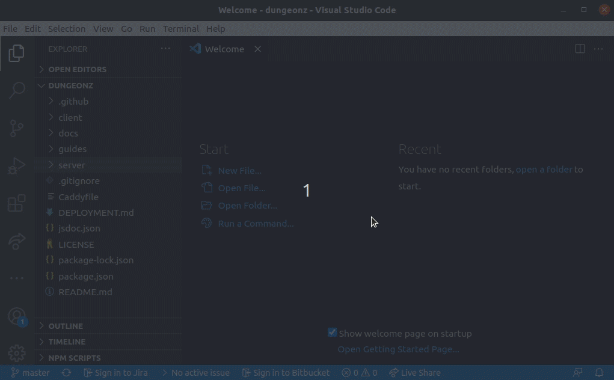
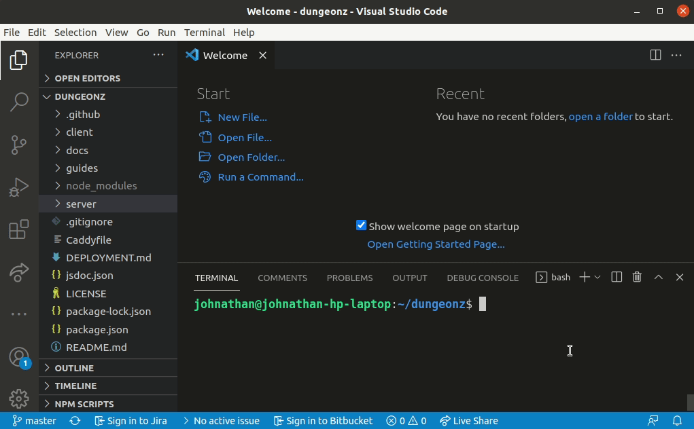
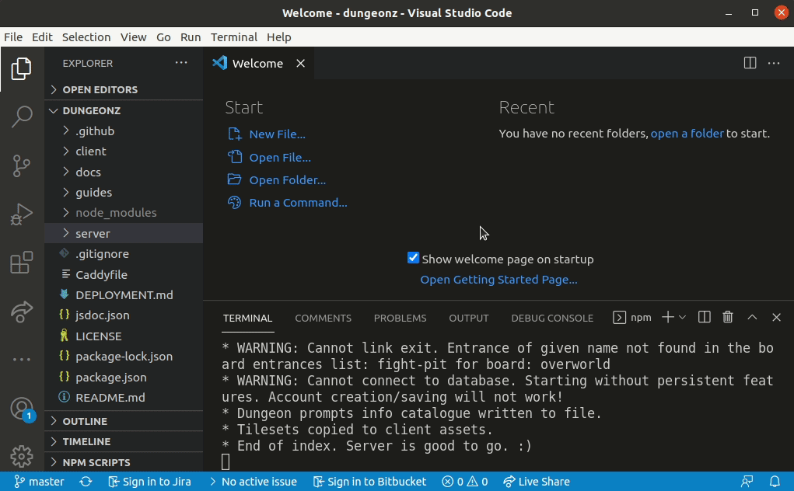

# Minimal setup

This guide is intended for newbs who are interested in the project, but don't know where to begin, so I assume little existing knowledge about many things. If some things don't make sense, then let me know and I will update this document with clarification.

## To run the project, you will need

- [NodeJS](https://nodejs.org/en/download/) installed (currently only v14.17.3 is officially supported, though other versions may work. If you are using a later version, you may run into this [issue arround node-sass build errors](https://github.com/Arcanorum/dungeonz/issues/164)). This is the JavaScript runtime that runs the game code. The NodeJS installation will also come with NPM, which is a utility used to download other packages/libraries that are required by an application.
- [VS Code](https://code.visualstudio.com/) installed. This is the visual editor IDE where you will be making most of your changes. VS Code comes with git integrated to allow getting updates from the repository easier when it gets updated. You can use another code editor if you wish, but you will also need git installed and know how to use it.
- [Tiled](https://www.mapeditor.org/) installed (if you want to edit maps).

>***Note:*** To keep things as easy to set up for this guide, the MongoDB database for player account storage is not included, so persistent features (player account creation) will not work. Consult the full setup guide for running the game with a database.

## Clone the repo
You will need to download the project files and set up the development environment to start editing files and hacking away.

All of the files are stored online in GitHub, and will first need to be copied from there to your own device for editing.

This can be done in VS Code using the git clone command from the interface.

On opening VS Code, on the left menu select Source Control, and then `Clone Repository` option.

Into the prompt enter the project repository URL:

`https://github.com/Arcanorum/dungeonz`

and select Clone from URL.

This will copy the current version of the project from GitHub to your computer.

***This may take a few minutes to finish...***

When successfully cloned, you should see an option to open the repository.

## Install dependencies
Not everything that the project needs to work is included in the repository. For the extra stuff, the external dependencies must be installed. This is done using NPM that came with the NodeJS installation.

Here we will need to use the terminal (AKA command line) to input the commands to run.

A new terminal can be opened within VS Code.

1. Top options bar
2. Terminal
3. New Terminal

And now you should see the terminal interface to enter commands.

In this terminal type out and then press enter:

`npm install`

Which will get the rest of the files (as defined in the *package.json* files) from NPM (this process might take a while) and add them to the *node_modules* folders which it should also create in *dungeonz*, *dungeonz/client* and *dungeonz/server*.

Now we should have everything needed to run the game.

## Start the server
In this same terminal run:

`npm run server:dev`

If everything went well, you should see an output like the following.

`* End of index. Server is good to go. :)`

The game server is now running, but the client (what the user sees in the browser) must be built and served.

## Start the client
Open another terminal (or split the existing one), so the server can remain running in the first terminal while we enter another command.

1. Top options bar
2. Terminal
3. Split Terminal

Now in this new terminal, run:

`npm run client:dev`

Which may take a minute to start up, but when it does it should open the game in your prefered browser on http://localhost:3000, or you can enter that into the URL bar manually.

And thats it!
